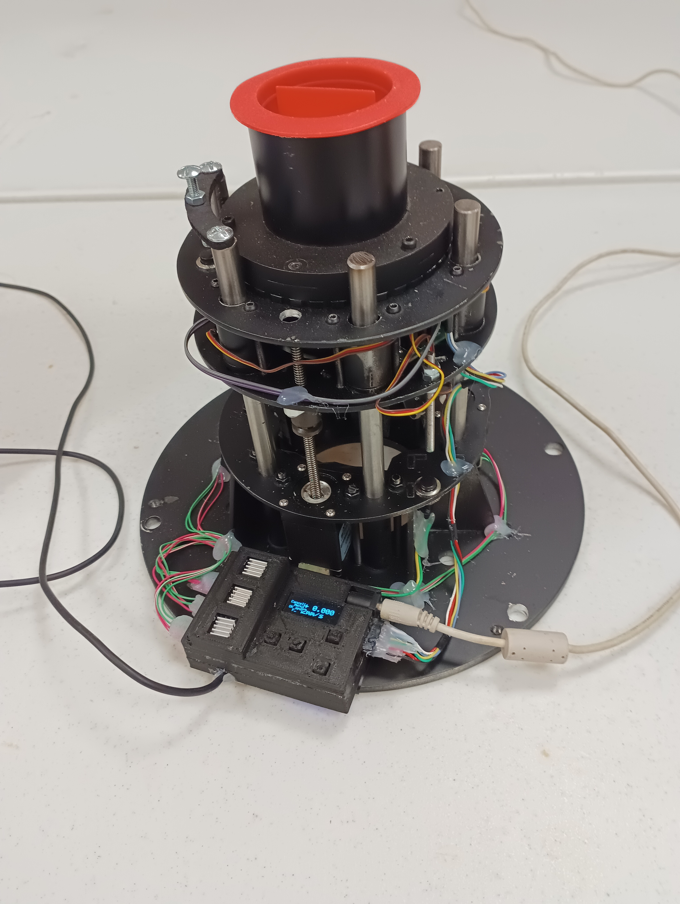
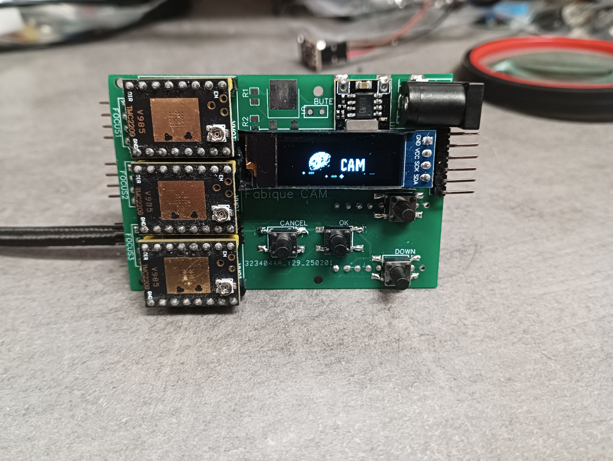
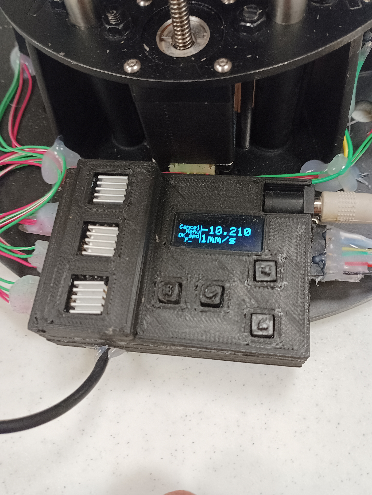
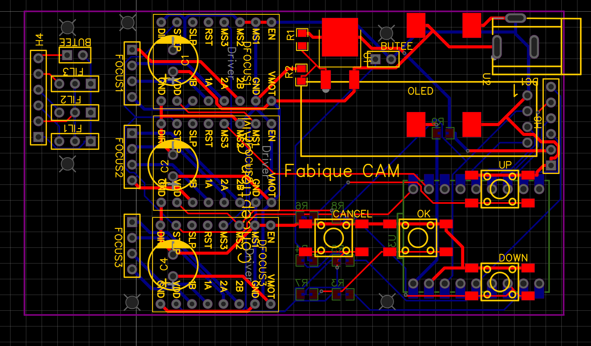

# RC_Focusser
This project is for a focusser that I made for the RC600 used by our club.
The design was to allow us to connect a focal reducer to the scope, hold the caméra, perform focus and has a filter wheel. All in one...

Althrough I assume that no-one will need a similar device, I have still published the project here as someone might want to reuse the electronic/SW part to make a focusser and or a filter wheel.

This supports Alpaca and Ascom through USB (with an ascom driver provided).
There is also a manual control through a small LCD and keys.

The focus is done through 3 motors which can be used together to focus, and independentely to perform tilt.

Here is the final product (around 20cm high)

and on the telescope

Here is a view of the elec part

Here it is in it's 3D printed box

Here are the schematics. esp32C3 + 12-5V power + 3*tmc2209 + a LCD and 4 keys + 3 PWM for the RC controlers that handle the filters + 2 end of movement sensors.

And the PCB

Contact me for if you have questions!
